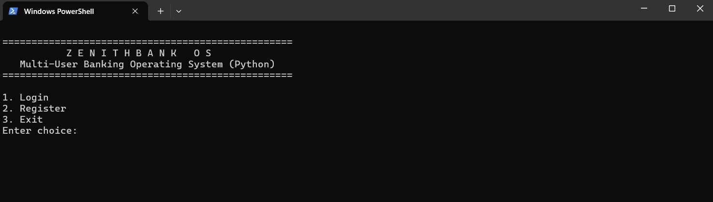

# ⚡ ZenithBank OS — Multi-User Banking Operating System (Python OOP + File Storage)

ZenithBank OS is an enterprise-style, modular multi-user banking operating system built entirely using **Python (OOP)** and **secure file-based storage**.  
It includes authentication, account management, transaction logging, automatic statements, audit logs, and a clean console interface — making it perfect for resumes, interviews, and GitHub portfolios.

---

## 🚀 Features

### 🔐 Multi-User Authentication
- Register new users
- Secure login with **SHA-256 hashed passwords**
- Credentials stored safely in JSON (not plain text)

### 🧾 Account Lifecycle
- Auto-generated account number: `ZB-YYYY-XXXX`
- Dedicated folder for every user
- Separate files for balance + transactions

### 💰 Banking Operations
- Deposit (with transaction ID & timestamp)
- Withdraw (with insufficient balance validation)
- Live balance updates
- Permanent transaction ledger

### 📜 Statement Export
- Export account statement as `.txt`
- Includes metadata, last transactions, and final balance

### 📁 Audit Logging
- Daily log files created in `/logs/`
- Every login, deposit, withdraw recorded
- Realistic banking audit system

### 🧩 Clean, Modular Architecture
- `bank_core.py` → Register/Login manager
- `account.py` → Core business logic
- `transaction.py` → Transaction model
- `storage.py` → File I/O + hashing
- `utils.py` → Helpers
- `app.py` → Console UI

---

## 🧑‍💻 Tech Stack

| Layer | Technology |
|-------|------------|
| Language | **Python 3.x** |
| Paradigm | **Object-Oriented Programming** |
| Storage | **File-based persistence (txt + JSON)** |
| Security | **SHA-256 password hashing** |
| Logging | **Daily audit logs** |
| Output | Console UI + exported statements |

**No external libraries required — pure Python.**

---

## 📂 Folder Structure

ZenithBank_OS/
│
├── app.py # Main UI / entry point
├── account.py # Account logic
├── bank_core.py # User manager (register/login)
├── transaction.py # Transaction model
├── storage.py # File I/O + hashing
├── utils.py # Helper functions
├── README.md # Documentation
├── .gitignore
│
├── assets/
│ └── output.png # Real execution screenshot
│
├── data/ # Auto-generated user data
│ └── users/
│ └── <username>/
│ ├── balance.txt
│ └── transactions.txt
│
└── logs/ # Daily audit logs

📌 **Note:** `data/` and `logs/` are ignored using `.gitignore` for privacy & security.

---

## 🖥️ Real Console Screenshot

---

## 📸 Sample Console Output

==================================================
Z E N I T H B A N K O S
Multi-User Banking Operating System (Python)

1.Login
2.Register
3.Exit
Enter choice: 2

--- Register New Account ---
Choose username: mohana
Set a password: ******
Initial deposit: 5000
Account created successfully!

--- Login ---
Username: mohana
Password: ******
Login successful. Welcome mohana!

1.Deposit
2.Withdraw
3.Check Balance
4.Transaction History
5.Export Statement
6.Logout

---

## ▶️ How to Run

### 1️⃣ Optional: Create virtual environment
'''
bash
python -m venv venv
.\venv\Scripts\activate
'''
### 2️⃣ Run the application
'''
bash
python app.py
'''
💡 `data/` and `logs/` folders will be auto-created.

---

## 🧪 Test Checklist

| Action            | Result                                 |
|-------------------|---------------------------------------- |
| Register User     | ✔ Folder + files created               |
| Login             | ✔ Password verified                    |
| Deposit           | ✔ Balance updated + logged             |
| Withdraw          | ✔ Validated + logged                   |
| Export Statement  | ✔ .txt file generated                  |
| Logs              | ✔ Daily log entry appended             |

---

## 🌱 Future Enhancements

- SQLite Migration  
- FastAPI REST API version  
- PDF bank statements  
- OTP / PIN System  
- Admin dashboard  
- GUI (Tkinter / PyQt)  

---

## ✨ Author

**Gundugollu Mohana Venkata Achuta Lakshmi**  
_Aspiring Software Developer • Backend Enthusiast_

---

⭐ **If you like this project, please give it a star!**

